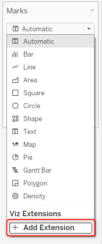
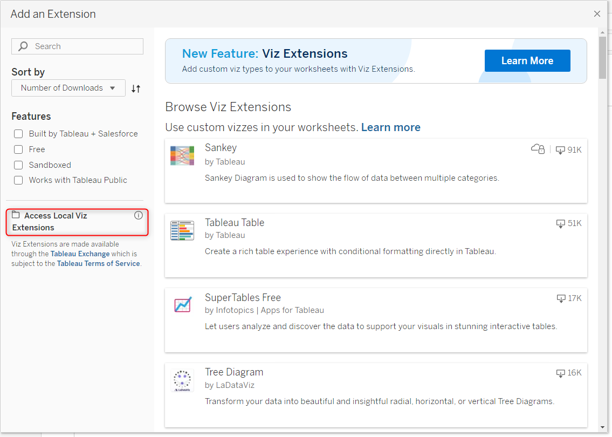
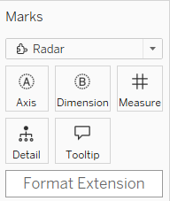
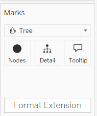
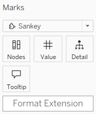

# Help Documentation (Viz)

> **Last updated:** July, 2025

## Quick Links

- [Radar](#radar)
- [Tree](#tree)
- [Sunburst](#sunburst)
- [Sankey](#sankey)

## General Information

### First Steps

Create a new sheet. Add an extension by selecting "add extension" in the dropdown-menu of the Marks card.

Select "Access Local Viz Extensions".

Select the .trex file corresponding to the extension to use.  
Allow the extension.  
A tutorial must be displayed in the extension.

### Actions

The viz extensions use the actions of Tableau. To filter other sheets on a dashboard, select the sheet of the extensions in the Action tab.

---

## [Radar](#radar)

### First Steps

Add a dimension to the Axis mark card, add a dimension to the Dimension mark card, and a measure to the Measure mark card.

### Data Format

The field in column will be used as the dimensions. The row will be the axis. The dataset must be complete (no null values).

### Customization

Click the format extension button in the mark card to customize the Radar. Three methods are available:

- **Direct**: Enter a value directly in the window.
- **Parameter**: Select a parameter; its value defines the characteristic.
- **Field**: Select a field in the sheet; its values define the element aspects.

You can change the following elements for the Radar:

| Name            | Default | Accepted Values |
|-----------------|---------|----------------|
| background color| white   | HTML names, hexadecimal, rgb. [See color names and codes](https://htmlcolorcodes.com/color-names/) |
| data color      | none    | HTML names, hexadecimal, rgb, palette |
| scale min       | auto    | Minimum value of the scale |
| scale max       | auto    | Maximum value of the scale |
| highlight color | red     | HTML names, hexadecimal, rgb |

### Example

Watch this tutorial video to learn how to create a Radar chart with the Sample - Superstore datasource:

<video src="./Media/radar-viz-add-extension.mp4" controls width="800">
  Your browser does not support the video tag. 
</video>

After adding the extension, add data to the Axis, Dimension and Measure mark cards.

<video src="./Media/radar-viz-display-graph.mp4" controls width="800">
  Your browser does not support the video tag. 
</video>

You can further customize the Radar. In this example, a calculated field changes the minimum axis value. The background is set using the direct method, and the color is chosen from the Tableau palette.

<video src="./Media/radar-viz-custom.mp4" controls width="800">
  Your browser does not support the video tag. 
</video>

Highlight part of the Radar by clicking a point. Click outside the Radar or on the highlighted point to remove the highlight.
<video src="./Media/radar-viz-actions.mp4" controls width="800">
  Your browser does not support the video tag.
</video>

---

## [Tree](#tree)

### First Steps

Add dimensions to the Nodes mark cards. To customize the width of the tree, add a measure to the Detail mark card. See the customization options below.

### Data Format

The data can be hierarchical or in a source/target format.

### Customization

Click the format extension button in the mark card to customize the Tree. Three methods are available:

- **Direct**: Enter a value directly in the window.
- **Parameter**: Select a parameter; its value defines the characteristic.
- **Field**: Select a field in the sheet; its values define the element aspects.

| Name                  | Default   | Accepted Values |
|-----------------------|-----------|----------------|
| background color      | white     | HTML names, hexadecimal, rgb. [See color names and codes](https://htmlcolorcodes.com/color-names/) |
| highlight color       | red       | HTML names, hexadecimal, rgb |
| width                 | none      | Field value |
| data color            | none      | HTML names, hexadecimal, rgb, classic values, palette |
| palette               | none      | (see palette list above) |
| depth                 | 3         | Number |
| save state            | false     | true, false |
| radial                | 0         | 0, 180, 360 |
| orientation           | east      | east, north, south, west |
| font size             | 14        | Number |
| node padding          | 20        | Number |
| node size             | 3         | Number |
| node stroke width     | 1.5       | Number |
| link color            | parent    | parent, child, none |
| link width            | 1.5       | Number |
| proportional labels   | false     | true, false |
| hide intermediate labels | false  | true, false |
| display values        | false     | true, false |

### Example

Watch this tutorial video to learn how to create a Tree chart with the Sample - Superstore datasource:

<video src="./Media/tree-viz-add-extension.mp4" controls width="800">
  Your browser does not support the video tag. 
</video>

After adding the extension, add data to the Nodes mark cards.
<video src="./Media/tree-viz-display-graph.mp4" controls width="800">
  Your browser does not support the video tag.
</video>

You can further customize the Tree. In this example, a calculated field changes the node color. Add the calculated field to the Detail mark card. Add the Sales measure to customize the tree width. The background is set using the direct method. Set the link color to "child."

<video src="./Media/tree-viz-custom.mp4" controls width="800">
  Your browser does not support the video tag.
</video>

Highlight part of the Tree by clicking a node. Double-click a node to display its children.

<video src="./Media/tree-viz-actions.mp4" controls width="800">
  Your browser does not support the video tag.
</video>

Watch this video to see how to display a radial tree and show the values of each node.
<video src="./Media/tree-viz-custom-further.mp4" controls width="800">
  Your browser does not support the video tag.
</video>

---

## [Sunburst](#sunburst)

### First Steps

Add a dimension to the Layer mark card and a measure to the Value mark card.

### Data Format

The data can be hierarchical and superior to 0.

### Customization

Click the format extension button in the mark card to customize the Sunburst. Three methods are available:

- **Direct**: Enter a value directly in the window.
- **Parameter**: Select a parameter; its value defines the characteristic.
- **Field**: Select a field in the sheet; its values define the element aspects.

| Name            | Default | Accepted Values |
|-----------------|---------|----------------|
| background color| white   | HTML names, hexadecimal, rgb. [See color names and codes](https://htmlcolorcodes.com/color-names/) |
| data color      | none    | HTML names, hexadecimal, rgb, palette |
| palette         | none    | (see palette list above) |
| number layers   | 2       | Number |
| layers padding  | 1       | Number |
| layers size     | none    | none, asc, desc |
| percentage      | false   | true, false |
| rotate labels   | false   | false, all, first |

### Example

Watch this tutorial video to learn how to create a Sunburst chart with the Sample - Superstore datasource:

<video src="./Media/sunburst-viz-add-extension.mp4" controls width="800">
  Your browser does not support the video tag.
</video>

After adding the extension, add data to the Layer and Value mark cards.

<video src="./Media/sunburst-viz-display-graph.mp4" controls width="800">
  Your browser does not support the video tag.
</video>

You can further customize the Sunburst. In this example, the background is set by entering a value directly. A parameter customizes the number of layers. The palette, layer size, percentage, and label rotation are set by selecting values in the dropdown menu.

<video src="./Media/sunburst-viz-custom.mp4" controls width="800">
  Your browser does not support the video tag.
</video>

Highlight part of the Sunburst by clicking a node. Double-click a node to drill down. Double-click the central circle to drill up.

<video src="./Media/sunburst-viz-actions.mp4" controls width="800">
  Your browser does not support the video tag.
</video>

---

## [Sankey](#sankey)

### First Steps

Add dimensions to the Nodes mark card and a measure to the Value mark card to display a Sankey.

### Data Format

Data is expected to have three columns: source, target, and values for each link. Additional fields in the sheet can be used to further customize the Sankey.

### Customization

Click the format extension button to customize the Sankey. Three methods are available:

- **Direct**: Enter a value directly in the window.
- **Parameter**: Select a parameter; its value defines the characteristic.
- **Field**: Select a field in the sheet; its values define the element aspects.

| Name            | Default | Accepted Values |
|-----------------|---------|----------------|
| background color| white   | HTML names, hexadecimal, rgb. [See color names and codes](https://htmlcolorcodes.com/color-names/) |
| highlight color | red     | HTML names, hexadecimal, rgb |
| link color      | none    | source, target, source-target, HTML names, hexadecimal, rgb, classic values, palette |
| palette         | none    | (see palette list above) |
| link percentage | none    | none, source, target, both |
| column palette  | none    | (see palette list above) |
| column percentage | false | true, false |
| column titles   | top     | none, top, bottom |
| alignment       | justify | justify, left, right, center |

#### Example

Watch this tutorial video to learn how to create a Sankey chart with the Sample - Superstore datasource:

<video src="./Media/sankey-viz-add-extension.mp4" controls width="800">
  Your browser does not support the video tag.
</video>

After adding the extension, add data to the Nodes and Value mark cards.
<video src="./Media/sankey-viz-display-graph.mp4" controls width="800">
  Your browser does not support the video tag.
</video>

You can further customize the Sankey. In this example, the background color is set by entering a value directly. The link color is set to source-target. The column palette is set to the Tableau palette Miller Stone. The link percentage is set to both, and the column percentage is set to true, by selecting values in the dropdown menu.

<video src="./Media/sankey-viz-custom.mp4" controls width="800">
  Your browser does not support the video tag.
</video>

Highlight part of the Sankey by clicking a node. Double-click a node to filter the Sankey and display only its links. Double-click the same node again to remove the filter.

<video src="./Media/sankey-viz-actions.mp4" controls width="800">
  Your browser does not support the video tag.
</video>
