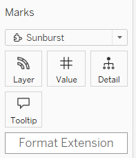

# Viz Extension Documentation - Sunburst

> **Last updated:** July, 2025

## Quick Links

- [Viz Extension Documentation - Home](Documentation-Viz.md)

### First Steps

Add a dimension to the Layer mark card and a measure to the Value mark card.

### Data Format

The data can be hierarchical and superior to 0.

### Customization

Click the format extension button in the mark card to customize the Sunburst. Three methods are available:

- **Direct**: Enter a value directly in the window.
- **Parameter**: Select a parameter; its value defines the characteristic.
- **Field**: Select a field in the sheet; its values define the element aspects.

| Name            | Default | Accepted Values | Additional Information |
|-----------------|---------|----------------|-------------------------|
| background color| white   | HTML names, hexadecimal, rgb. [See color names and codes](https://htmlcolorcodes.com/color-names/) | Ex: LightBlue, #ADD8E6, rgb(173, 216, 230). |
| data color      | none    | HTML names, hexadecimal, rgb |
| palette         | none    | tableau 10, tableau 20, colorblind, seattle grays, traffic light, miller stone, superfishel stone, nuriel stone, jewel bright, summer, winter, green-orange-teal, red-blue-brown, purple-pink-gray, hue circle |
| number layers   | 2       | Number |
| layers padding  | 1       | Number | Space between layers |
| layers size     | none    | none, asc, desc |
| percentage      | false   | true, false | Display percentages below the labels |
| rotate labels   | false   | false, all, first |
| font size       | 10      | Numbers |  |

### Example

Watch this tutorial video to learn how to create a Sunburst chart with the Sample - Superstore datasource:

<video src="./Media/sunburst-viz-add-extension.mp4" controls width="800">
  Your browser does not support the video tag.
</video>

After adding the extension, add data to the Layer and Value mark cards.

<video src="./Media/sunburst-viz-display-graph.mp4" controls width="800">
  Your browser does not support the video tag.
</video>

You can further customize the Sunburst. In this example, the background is set by entering a value directly. A parameter customizes the number of layers. The palette, layer size, percentage, and label rotation are set by selecting values in the dropdown menu.

<video src="./Media/sunburst-viz-custom.mp4" controls width="800">
  Your browser does not support the video tag.
</video>

Highlight part of the Sunburst by clicking a node. Double-click a node to drill down. Double-click the central circle to drill up.

<video src="./Media/sunburst-viz-actions.mp4" controls width="800">
  Your browser does not support the video tag.
</video>

---
