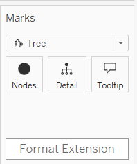

# Viz Extension Documentation - Tree

> **Last updated:** July, 2025

## Quick Links

- [Viz Extension Documentation - Home](Documentation-Viz.md)

### First Steps

Add dimensions to the Nodes mark cards. To customize the width of the tree, add a measure to the Detail mark card. See the customization options below.

### Data Format

The data can be hierarchical or in a source/target format.

### Customization

Click the format extension button in the mark card to customize the Tree. Three methods are available:

- **Direct**: Enter a value directly in the window.
- **Parameter**: Select a parameter; its value defines the characteristic.
- **Field**: Select a field in the sheet; its values define the element aspects.

| Name                  | Default   | Accepted Values | Additional Information |
|-----------------------|-----------|----------------| -------------------------|
| background color      | white     | HTML names, hexadecimal, rgb. [See color names and codes](https://htmlcolorcodes.com/color-names/) | Ex: LightBlue, #ADD8E6, rgb(173, 216, 230). |
| highlight color       | red       | HTML names, hexadecimal, rgb |
| width                 | none      | Field value | Width of the tree diagram. |
| data color            | none      | HTML names, hexadecimal, rgb|
| palette               | none      | tableau 10, tableau 20, colorblind, seattle grays, traffic light, miller stone, superfishel stone, nuriel stone, jewel bright, summer, winter, green-orange-teal, red-blue-brown, purple-pink-gray, hue circle |
| depth                 | 3         | Number | Number of layers displayed by default in the tree diagram. |
| save state            | false     | true, false | If true, the tree state (if the nodes are open or closed) is saved when the dashboard is closed and restored when reopened.
| radial                | 0         | 0, 180, 360 |
| orientation           | east      | east, north, south, west |
| font size             | 14        | Number | The font size of the value are always 2px thinner than the selected font size. |
| node padding          | 30/70     | Number | If the orientation is south or north, the pading is set to 70 by default.|
| node size             | 3         | Number |
| node stroke width     | 1.5       | Number | Width of the circle if no field is selected for Width customization. |
| link color            | parent    | parent, child, none |
| link width            | 1.5       | Number | Width of the link if no field is selected for Width customisation. |
| proportional labels   | false     | true, false |
| hide intermediate labels | false  | true, false |
| display values        | false     | true, false |

### Example

Watch this tutorial video to learn how to create a Tree chart with the Sample - Superstore datasource:

<video src="./Media/tree-viz-add-extension.mp4" controls width="800">
  Your browser does not support the video tag. 
</video>

After adding the extension, add data to the Nodes mark cards.
<video src="./Media/tree-viz-display-graph.mp4" controls width="800">
  Your browser does not support the video tag.
</video>

You can further customize the Tree. In this example, a calculated field changes the node color. Add the calculated field to the Detail mark card. Add the Sales measure to customize the tree width. The background is set using the direct method. Set the link color to "child."

<video src="./Media/tree-viz-custom.mp4" controls width="800">
  Your browser does not support the video tag.
</video>

Highlight part of the Tree by clicking a node. Double-click a node to display its children.

<video src="./Media/tree-viz-actions.mp4" controls width="800">
  Your browser does not support the video tag.
</video>

Watch this video to see how to display a radial tree and show the values of each node.
<video src="./Media/tree-viz-custom-further.mp4" controls width="800">
  Your browser does not support the video tag.
</video>

---
